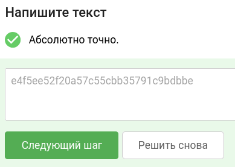

# Уровень 1. Практика "Разведка во внешней сети"
## Практика «Поиск ресурсов организации»

### 📝 Задание

Вы точно знаете, что основной домен организации — `cyber-ed.ru`.
Ваша задача: постараться найти как можно больше поддоменов, связанных с этой организацией.

Некоторые поддомены в TXT-записи DNS-сервера содержат различные флаги.
В одном из поддоменов (кстати, его имя будет логически связано с заданием) будет TXT-запись с флагом в формате: `FLAG=значение_флага`, где "значение_флага" — это смесь из 32 произвольных букв и цифр.

**Цель:** найти этот флаг и предоставить его значение.

---

### 🛠 Шаг 1. Инструменты

Всё необходимое для решения:
1. **Stepik** — для сдачи флага.
2. **Терминал** — для удобного выполнения команд.
3. **Subfinder** — утилита для быстрого пассивного поиска поддоменов.
4. **nslookup** — сетевая утилита для проверки DNS-записей.

---

### 🔍 Шаг 2. Разведка

#### 1) Поиск поддоменов
Устанавливаем Subfinder и при помощи утилиты сканируем все поддомены нашей цели:

```bash
subfinder -d cyber-ed.ru
```
* `subfinder` — наша утилита
* `-d` — флаг (сокращение от английского слова *domain*)
* `cyber-ed.ru` — наша цель

#### 2) Анализ
После завершения работы утилиты просматриваем полученный список поддоменов. Нам нужно найти тот, который логически связан с нашим заданием (как сказано в условии).

**Самые подозрительные поддомены:**
* `infctf.cyber-ed.ru`
* `one-task.cyber-ed.ru`
* `task.cyber-ed.ru`

#### 3) Проверка DNS-записей
Теперь проверим эти подозрительные поддомены при помощи `nslookup`:

```bash
nslookup -q=TXT infctf.cyber-ed.ru
nslookup -q=TXT one-task.cyber-ed.ru
nslookup -q=TXT task.cyber-ed.ru
```
* `nslookup` — утилита для обращения к DNS-серверам
* `-q=` — флаг, который расшифровывается как *query* (запрос)
* `TXT` — тип запрашиваемой записи (текстовая)
* `task.cyber-ed.ru` — наша цель (поддомен)

---

### 🏁 Шаг 3. Вывод

При проверке поддомена `task.cyber-ed.ru` мы обнаружили следующую запись от сервера:

```text
text = "FLAG=e4f5ee52f20a57c55cbb35791c9bdbbe"
```

🎉 **`e4f5ee52f20a57c55cbb35791c9bdbbe`** — это наш флаг (ответ для Stepik).

