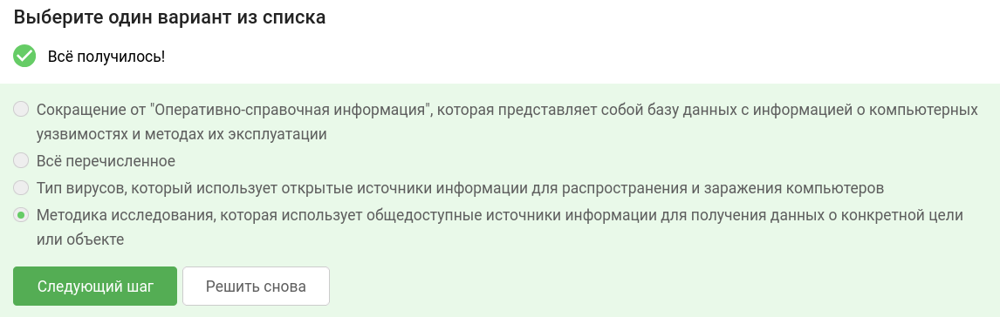
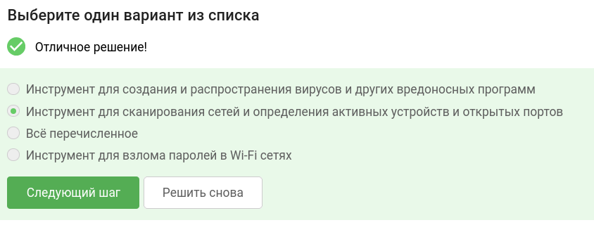
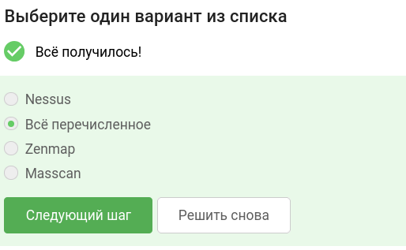
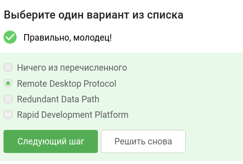
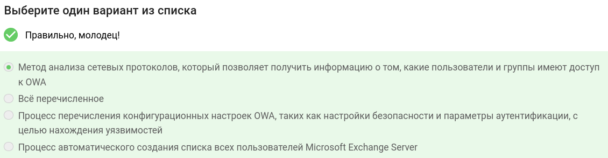
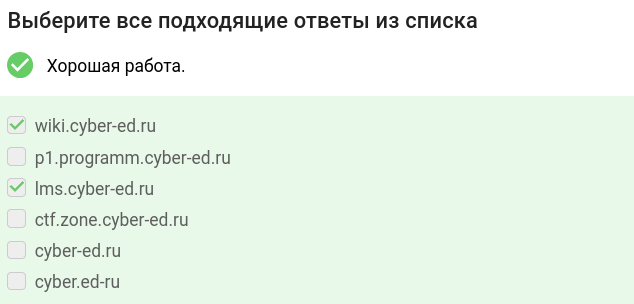
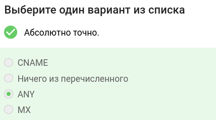
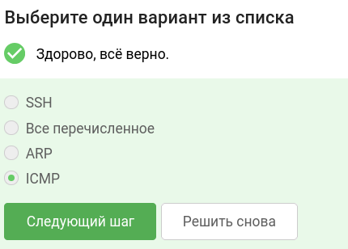
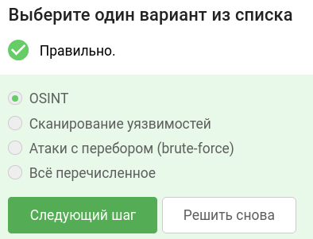

В завершении занятия вам предстоит пройти тестирование по изученному материалу, чтобы закрепить и систематизировать полученные знания.

Тест состоит из 10 вопросов. Вы можете выбрать все подходящие ответы из списка, или один единственно верный вариант ответа.

Успешное прохождение теста позволит вам оценить свой уровень знаний в области кибербезопасности и подготовиться к следующему занятию. Желаем вам удачи!

## Что такое OSINT?

## Для чего нужен Nmap?

## Что из перечисленного является сканером сети? 

## Как расшифровывается RDP?

## Что такое OWA (Outlook Web Access) Enumeration?

## Выберите домены 3-го уровня:

## Какой DNS записи не существует?

## Какой из данных протоколов предназначен для передачи сервисных сообщений на сетевом уровне?

## Какое из перечисленных действий обычно выполняется на этапе разведки при тестировании на проникновение?
