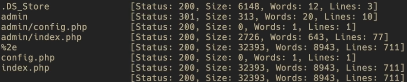
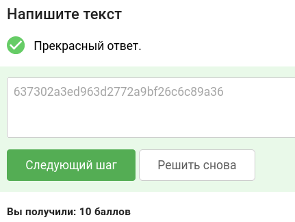

# Уровень 2.1 Практика "Уязвимости обхода аутентификации"

## 🎯 Задание
Перед вами уязвимое веб-приложение — онлайн-магазин курсов.

**Ваша задача:** проанализировать защищенность механизмов аутентификации административной панели и проэксплуатировать найденные уязвимости.

В качестве подтверждения успешной эксплуатации предоставьте флаг (секретную строку в формате 32 букв и цифр) из кода страницы панели администратора.

**Цель:** найти этот флаг и предоставить его значение.

---

## 🛠 Шаг 1. Инструменты
Всё необходимое для решения:
1. **Stepik** — для сдачи флага.
2. **courses-shop.zip** — сама задача в виде архива.
3. **Терминал** — для удобного выполнения команд.
4. **Docker** — для запуска архива в изолированном контейнере.
5. **Burp Suite Community** — утилита для перехвата пакетов и брутфорса.
6. **Словарь для брутфорса пароля админа** — [realyBest.txt](https://github.com/empty-jack/YAWR/blob/master/brute/passwords/realyBest.txt)
7. **ffuf** — утилита для перебора скрытых файлов и директорий (фаззинга).
8. **Словарь для фаззинга** — [fuzz.txt](https://github.com/empty-jack/YAWR/blob/master/Web/files_and_directories/fuzz.txt)

---

## 🚀 Шаг 2. Запуск стенда
Для подготовки стенда:
1. Необходимо скачать архив по ссылке из курса: `courses-shop.zip`.
2. Распаковать данный архив и перейти в появившуюся директорию `courses-shop-prod` в терминальной оболочке вашей ОС.
3. Выполнить команду (при запущенном сервисе Docker):
   ```bash
   docker-compose up -d
   ```
4. По адресу http://localhost:1337 появится веб-приложение лабораторного стенда.

---

## 🔍 Шаг 3. Разведка
Этапы разведки:
1. Открываем наш контейнер в браузере по адресу http://localhost:1337.
2. Применяем утилиту `ffuf` для обнаружения существующих путей до файлов и директорий на веб-сервере (используя заранее скачанный словарь `fuzz.txt`).

```bash
ffuf -w ~/Вашпуть/fuzz.txt -u http://localhost:1337/FUZZ -fc 403
```
> **Справка по команде:**
> * `-w` — путь до файла со словарем (замените `~/Вашпуть/` на ваш реальный путь).
> * `-u` — целевой URL (наша цель `http://localhost:1337`).
> * `FUZZ` — маркер, на место которого `ffuf` будет подставлять слова из словаря.
> * `-fc 403` — фильтрация кодов HTTP-ответов (игнорируем страницы с ошибкой `403 Forbidden`, чтобы не мусорить в терминале).

**Вывод утилиты:**


---

## 🔓 Шаг 4. Взлом admin панели
1. В выводе мы увидели директорию `admin`.
2. Заходим в **Burp Suite** -> вкладка `Proxy` -> `Intercept on` -> `Open Browser`. Переходим по адресу http://localhost:1337/admin.
3. Попадаем в админ-панель. Вводим любые фейковые данные и перехватываем пакет авторизации с помощью Burp Suite.
4. Кликаем ПКМ по перехваченному запросу и отправляем его в **Intruder** (`Send to Intruder`).
5. Переходим во вкладку *Intruder*. Выделяем значения `username` и `password` как payload (выделяем то, что находится после символа `=`).
6. Настраиваем тип атаки (*Attack type*) на **Cluster bomb**.
7. **Настраиваем Payload 1 (username):** Оставляем только админа.
   * Идем в настройки Payload 1.
   * Жмем `Payload configuration` -> `Add` -> Пишем: `admin`.
8. **Настраиваем Payload 2 (password):** Используем скачанный словарь паролей `realyBest.txt`.
   * Идем в настройки Payload 2.
   * Копируем содержимое словаря и вставляем через кнопку `Paste`.
9. Жмем **Start attack** и ждем примерно 5-10 минут.
10. Просматриваем результаты перебора. Видим, что на одном из запросов (например, на 111-м) значительно изменилась длина ответа (`Length`) и статус-код сменился на `303`.

Исходя из этого, мы подобрали верный пароль:
* **username** = `admin`
* **password** = `q1w2e3r4`

---

## 🔑 Шаг 5. Взлом OTP
Переходим к следующему этапу обхода:
1. Логинимся под `admin` с известным нам паролем: `q1w2e3r4`.
2. Попадаем на страницу ввода одноразового кода (OTP).
3. Нажимаем `F12` (Инструменты разработчика) в браузере и видим, что разработчик случайно оставил сам OTP-код в исходном коде страницы!
4. Копируем его, вставляем в форму и попадаем в `main.php`.

---

## 🏆 Шаг 6. Захват флага
1. Найти финальный флаг проще простого.
2. Находясь на странице `main.php`, снова нажимаем `F12` для вызова исходного кода элемента.
3. Пролистав код до конца, вы найдете спрятанный флаг.

**Ответ для Stepik:** `637302a3ed963d2772a9bf26c6c89a36`

