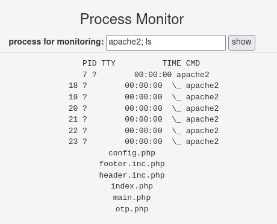
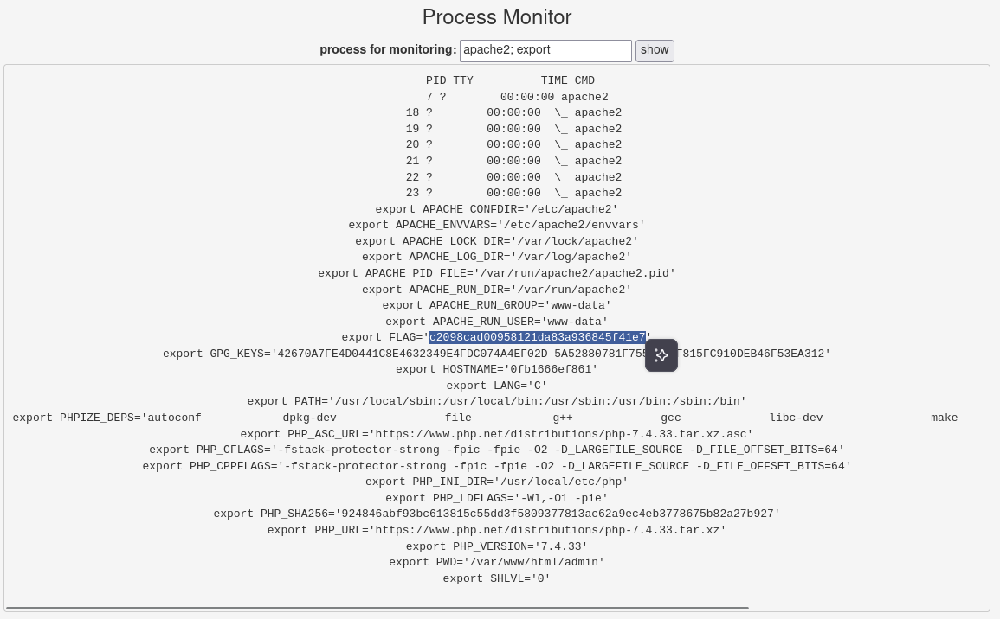
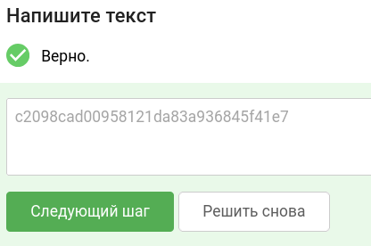

# Уровень 2.1 Практика "Уязвимости инъекции команд ОС"
## Практика «Уязвимости инъекции команд ОС»

## 🎯 Задание
Используйте стенд `courses-shop.zip` из предыдущих уроков.

**Задача:** проанализировать функционал работы с процессами ОС в панели администратора. Обнаружить и проэксплуатировать уязвимость внедрения команд (Command Injection) для получения конфиденциальных данных из системы.

**Цель:** найти секретный флаг в переменных окружения операционной системы.

---

## 🛠 Шаг 1. Инструменты
Всё необходимое для решения:
1. **Stepik** — для сдачи флага.
2. **courses-shop.zip** — сама задача в виде архива.
3. **Docker** — для запуска архива в изолированном контейнере.
4. **Браузер** — для взаимодействия с веб-интерфейсом.

---

## 🚀 Шаг 2. Запуск стенда
Если стенд еще не запущен:
1. Перейдите в директорию `courses-shop-prod`.
2. Выполните команду в терминале вашей ОС:
   ```bash
   docker-compose up -d
   ```
3. Приложение будет доступно по адресу: http://localhost:1337

---

## 🔍 Шаг 3. Разведка и поиск уязвимости
После прохождения этапа аутентификации с (прошлого уровня) мы находимся на странице `main.php`.
Здесь реализована форма мониторинга системных процессов.

### Тестирование функционала:
1. Введем название процесса, например `apache2`.
2. Система возвращает вывод системной утилиты, отображая статус процесса.

### Проверка на Command Injection:
Попробуем использовать оператор разделения команд `;`. Он сообщает командному интерпретатору (Shell), что нужно выполнить вторую команду сразу после первой.

**Полезная нагрузка (Payload):**
```bash
apache2; ls
```

> **Разбор синтаксиса:**
> * `apache2` — штатный ввод для программы (имя процесса).
> * `;` — оператор Shell для разделения команд.
> * `ls` — команда для вывода списка файлов и каталогов в текущей директории.

**Вывод утилиты:**


Мы видим содержимое рабочей директории сервера. Это полностью подтверждает наличие уязвимости **OS Command Injection**. Теперь мы можем выполнять произвольные команды в контексте веб-сервера.

---

## 🏆 Шаг 4. Захват флага
Согласно условию задания, флаг скрыт в переменных окружения ОС. В Linux для их вывода используется команда `export`.

**Исполнение финальной команды:**
```bash
apache2; export
```

> **Разбор синтаксиса:**
> * `export` — встроенная команда bash, которая выводит список всех переменных среды текущего сеанса.

**Вывод утилиты:**


Среди выведенных системных переменных находим нужную нам строку:
```bash
export FLAG='c2098cad00958121da83a936845f41e7'
```

**Ответ для Stepik:** `c2098cad00958121da83a936845f41e7`



---
### тгк: [BoCoder_Python](https://t.me/BoCoder_Python)