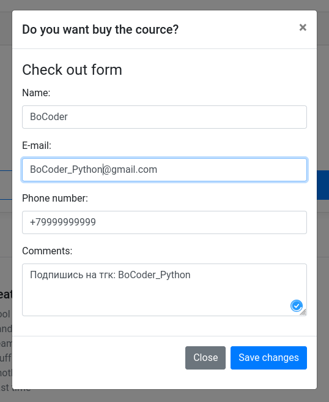
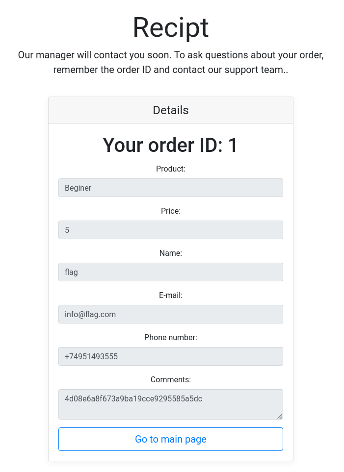
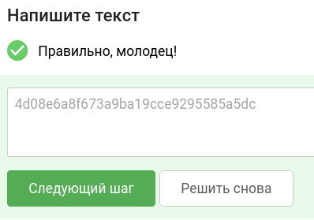

# Уровень 2.1 Практика "Уязвимости контроля доступа"
## Практика «Уязвимости контроля доступа»

## 🎯 Задание
Используйте стенд `courses-shop.zip` из предыдущих уроков.

**Задача:** проанализировать защищенность механизма проверки информации о заказе в магазине курсов. Обнаружить уязвимости контроля доступа, позволяющие исследовать содержимое заказов других пользователей.

**Цель:** найти и предоставить секретный флаг (строку в формате 32 букв и цифр) из заказа №1 в интернет-магазине.

---

## 🛠 Шаг 1. Инструменты
Всё необходимое для решения:
1. **Stepik** — для сдачи флага.
2. **courses-shop.zip** — архив с исходным кодом и окружением задачи.
3. **Docker** — для запуска стенда в изолированном контейнере.
4. **Браузер** — для взаимодействия с веб-интерфейсом приложения.

---

## 🚀 Шаг 2. Запуск стенда
Если стенд еще не запущен:
1. Перейдите в рабочую директорию `courses-shop-prod` через терминал.
2. Выполните команду для развертывания:
   ```bash
   docker-compose up -d
   ```
3. После успешного запуска приложение будет доступно по адресу: http://localhost:1337

---

## 🔍 Шаг 3. Разведка и поиск уязвимости
Для исследования логики работы приложения создадим собственный тестовый заказ.

### Ход исследования:
1. Переходим на главную страницу магазина:


2. Выбираем курс за $5 / mo и нажимаем кнопку **Buy this course**.
3. В появившейся форме вводим любые демонстрационные данные для заполнения контактной информации:


4. Нажимаем **Save changes**, после чего система перенаправляет нас на страницу с чеком нашего заказа.
5. Обращаем внимание на URL-адрес текущей страницы:
   `http://localhost:1337/receipt.php?orderID=2`

> **Анализ уязвимости:**  
> Идентификатор заказа передается напрямую через GET-параметр `orderID=2`. Если веб-приложение не проверяет права доступа текущего пользователя к запрашиваемому объекту, мы имеем дело с уязвимостью **IDOR (Insecure Direct Object Reference)**.

6. Попробуем совершить манипуляцию с параметром и изменить значение `orderID` на **1**, чтобы попытаться получить доступ к чужому (самому первому) заказу в системе.

---

## 🏆 Шаг 4. Захват флага
1. Меняем значение параметра в адресной строке браузера и переходим по адресу:
   `http://localhost:1337/receipt.php?orderID=1`

2. Система успешно обрабатывает запрос и отображает данные чужого заказа с ID=1 без какой-либо авторизации:


3. Внимательно изучаем содержимое страницы. В поле комментариев к заказу находится целевой флаг:
   `4d08e6a8f673a9ba19cce9295585a5dc`

**Ответ для Stepik:** `4d08e6a8f673a9ba19cce9295585a5dc`



---
### тгк: [BoCoder_Python](https://t.me/BoCoder_Python)