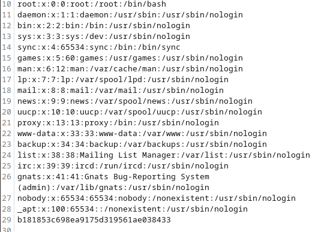
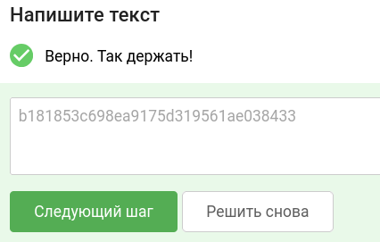

# Уровень 2.1 Практика "Уязвимости разграничения доступа к каталогам"
## Практика «Уязвимости разграничения доступа к каталогам»

## 🎯 Задание
Используйте стенд `courses-shop.zip` из предыдущих уроков.

**Задача:** проанализировать трафик приложения и исследовать механизм подгрузки статических изображений. Обнаружить уязвимость манипуляции путями к каталогам (Path Traversal) и проэксплуатировать её.

**Цель:** в качестве подтверждения успешной эксплуатации уязвимости извлечь секретный флаг (строку в формате 32 букв и цифр) из системного файла `/etc/passwd`.

---

## 🛠 Шаг 1. Инструменты
Всё необходимое для решения:
1. **Stepik** — для сдачи флага.
2. **courses-shop.zip** — архив с исходным кодом и окружением задачи.
3. **Docker** — для запуска стенда в изолированном контейнере.
4. **Burp Suite** — для перехвата, анализа и модификации HTTP-запросов.
5. **Браузер** — для взаимодействия с веб-интерфейсом.

---

## 🚀 Шаг 2. Запуск стенда
Если стенд еще не запущен:
1. Перейдите в рабочую директорию `courses-shop-prod` через терминал.
2. Выполните команду для развертывания:
   ```bash
   docker-compose up -d
   ```
3. После успешного запуска приложение будет доступно по адресу: http://localhost:1337

---

## 🔍 Шаг 3. Разведка и поиск уязвимости
Нам необходимо понять, как сервер обрабатывает и выдает файлы (например, картинки) пользователю.

### Ход исследования:
1. Переходим на главную страницу магазина:


2. Запускаем **Burp Suite** и включаем перехват. Заранее настроим фильтр отображения в истории, чтобы не пропустить загрузку медиафайлов:
   * Переходим во вкладку `Proxy` -> `HTTP history`.
   * Кликаем на панель **Filter** (прямо под названием вкладки).
   * В чекбоксах *Filter by MIME type* обязательно активируем пункты **CSS** и **Images**, после чего применяем настройки.

3. Нажимаем кнопку **Buy this course** у курса за $5/mo.
4. Заполняем появившуюся форму любыми демонстрационными данными.
5. Анализируем перехваченные запросы в Burp Suite. Среди потока трафика находим подозрительный запрос к скрипту, который отвечает за отображение картинок:
   ```http
   GET /image.php?file=apple-touch-icon-57x57.png HTTP/1.1
   Host: localhost:1337
   ```

> **Анализ уязвимости:**  
> Передача имени файла напрямую в параметре `?file=` — это классический маркер потенциальной уязвимости **Path Traversal (или Arbitrary File Read)**. Если сервер не фильтрует этот ввод, он может прочитать и выдать нам любой файл из системы.

6. Кликаем правой кнопкой мыши по этому запросу и отправляем его в **Repeater** (`Ctrl + R`).
7. Проведем быстрый тест. Попробуем передать префикс `./`, который в Linux указывает на текущую директорию:
   `GET /image.php?file=./apple-touch-icon-57x57.png`  
   Картинка успешно отдается, сервер никак не ругается на спецсимволы. Путь открыт!

---

## 🏆 Шаг 4. Захват флага
Теперь попробуем выйти за пределы веб-каталога и добраться до корневой файловой системы Linux, используя последовательность символов `../` (подняться на один уровень выше).

1. Вкладка **Repeater** в Burp Suite. Модифицируем параметр `file`, подставляя несколько переходов назад, чтобы гарантированно оказаться в корне системы, а затем указываем путь к целевому файлу `/etc/passwd`:
   ```http
   GET /image.php?file=../../../../etc/passwd HTTP/1.1
   Host: localhost:1337
   ```

2. Отправляем запрос и смотрим на ответ сервера. Сервер успешно прочитал системный файл и вернул нам его содержимое:


3. Пролистываем полученное содержимое `/etc/passwd` в самый низ. Там, в виде фейкового пользователя или системного комментария, находится наш заветный флаг:
   `b181853c698ea9175d319561ae038433`

**Ответ для Stepik:** `b181853c698ea9175d319561ae038433`



---
### тгк: [BoCoder_Python](https://t.me/BoCoder_Python)