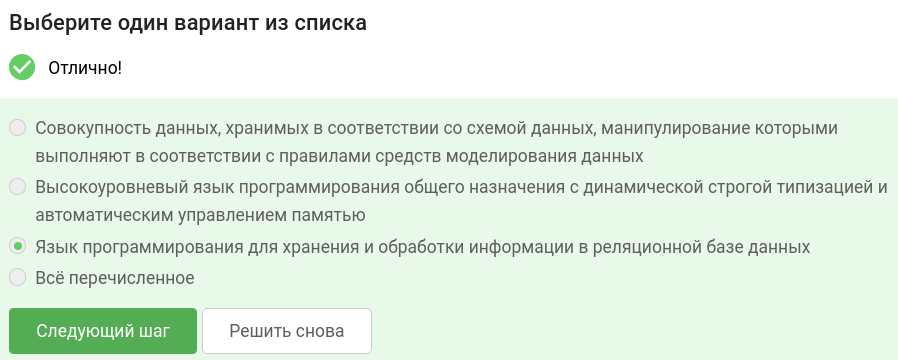
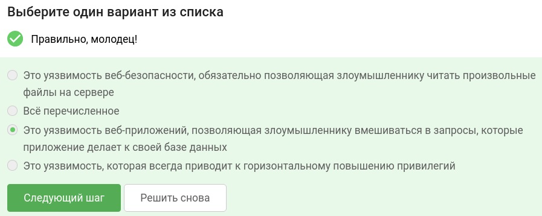
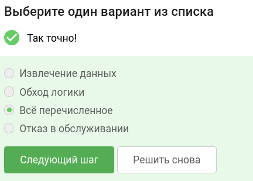
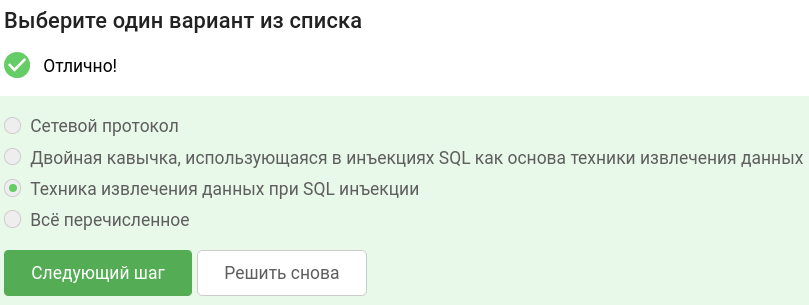
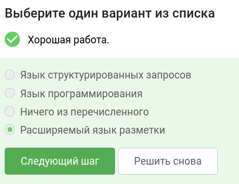
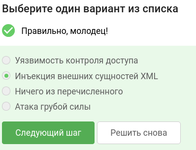
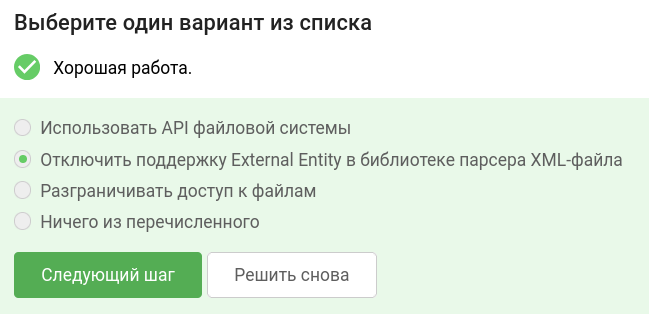
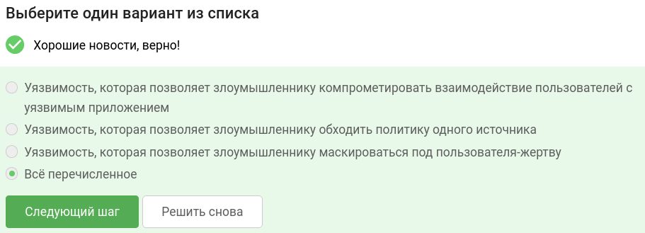
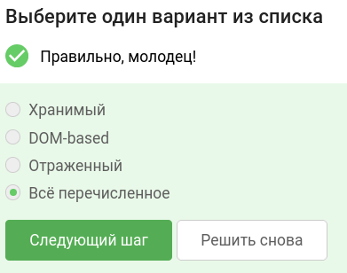
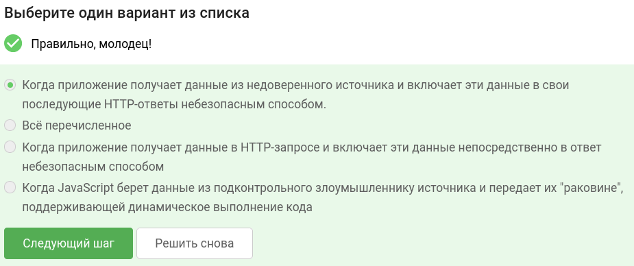

В завершении занятия вам предстоит пройти тестирование по изученному материалу, чтобы закрепить и систематизировать полученные знания.

Тест состоит из 10 вопросов с одним вариантом ответа. Если в каком-то вопросе кажется, что несколько ответов верны —  выберите наиболее точный из них.

Успешное прохождение теста позволит вам оценить свой уровень знаний в области кибербезопасности и подготовиться к следующему занятию. Желаем вам удачи!

## Что такое SQL?

## Что такое SQL-инъекция? 

## К чему могут приводить уязвимости SQL-инъекций? 

## Boolean blind — это...

## Что такое XML?

## Что такое XXE?

## Самый простой и эффективный способ предотвратить XXE-атаки:

## Cross-site scripting — это...

## Какие могут быть типы XSS-атак?

## Когда возникает хранимый XSS?

