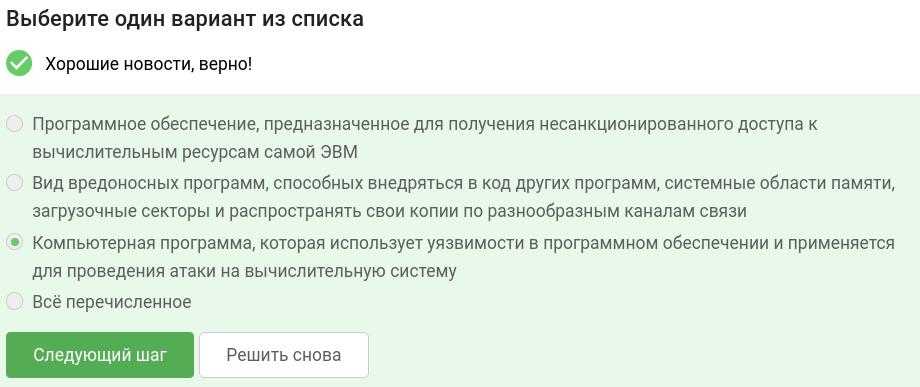
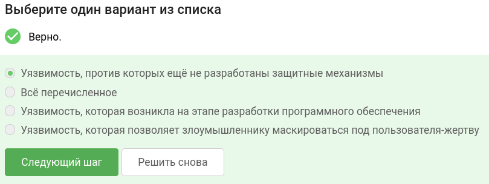
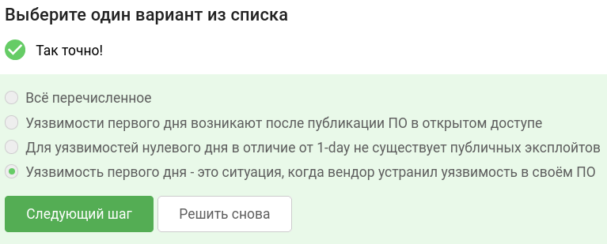
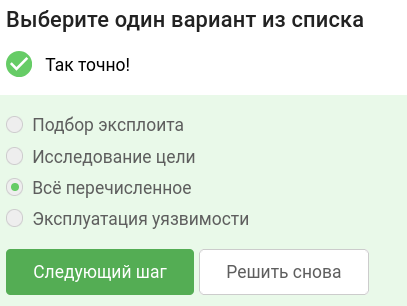
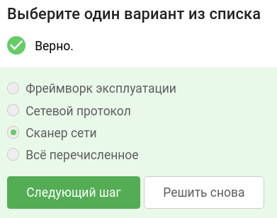
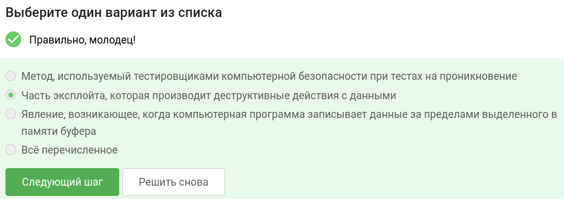
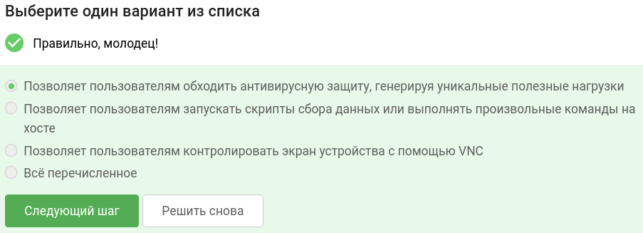
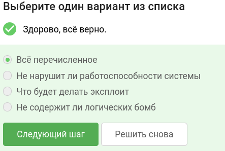
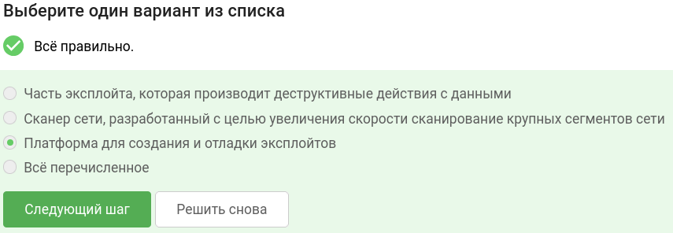
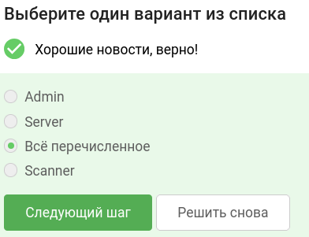

В завершении занятия вам предстоит пройти тестирование по изученному материалу, чтобы закрепить и систематизировать полученные знания.

Тест состоит из 10 вопросов с одним вариантом ответа. Если в каком-то вопросе кажется, что несколько ответов верны —  выберите наиболее точный из них.

Успешное прохождение теста позволит вам оценить свой уровень знаний в области кибербезопасности и подготовиться к следующему занятию. Желаем вам удачи!

## Что такое эксплоит?

## Что принято называть уязвимостью нулевого дня? 

## Чем отличается уязвимость нулевого дня от уязвимости первого дня?

## Из каких этапов состоит эксплуатация известных уязвимостей?

## Что такое Nmap?

## Что такое полезная нагрузка?

## Что делает динамическая полезная нагрузка?

## Что следует проверить перед использованием эксплоита? 

## Что такое фреймворк эксплуатации?

## Выберите тип вспомогательных модулей фреймворка Metasploit

### тгк: [BoCoder_Python](https://t.me/BoCoder_Python)