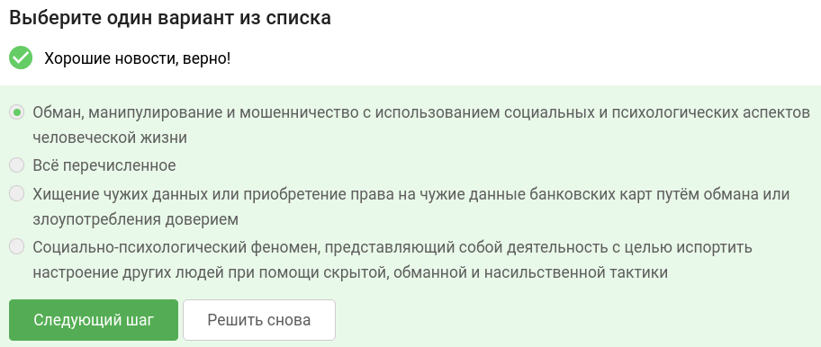
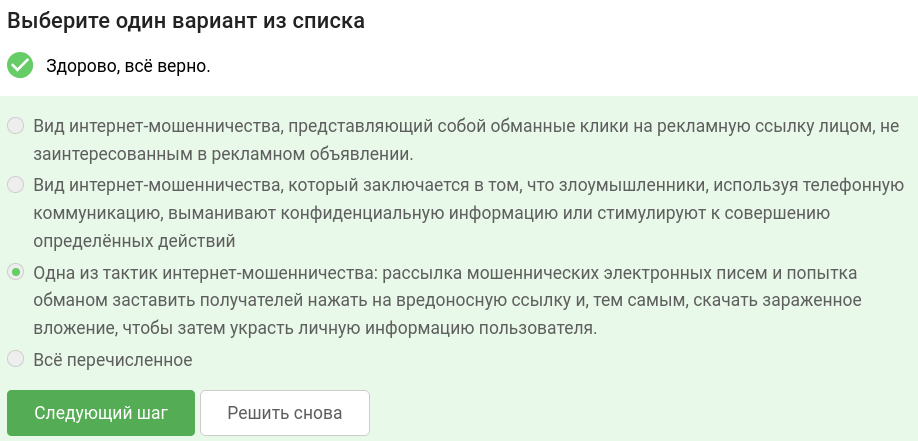
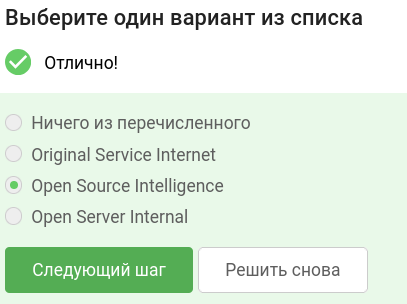
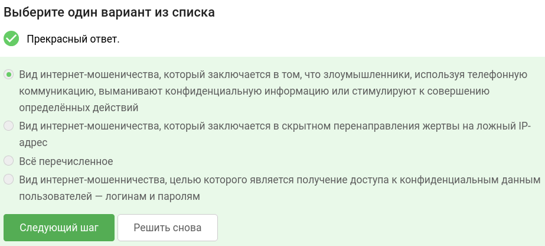
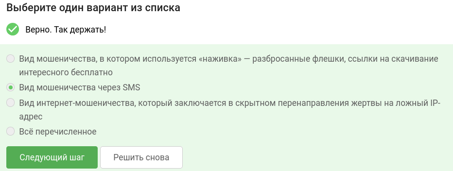
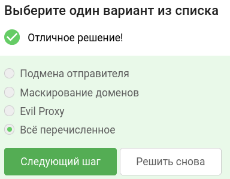
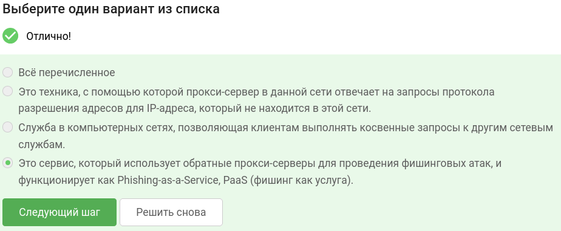
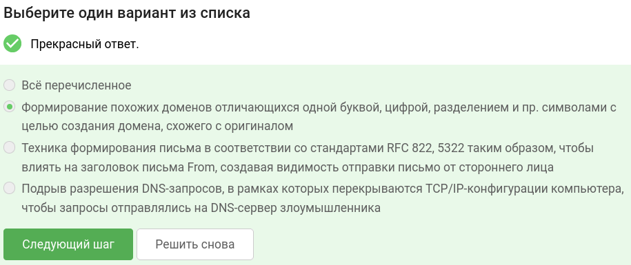
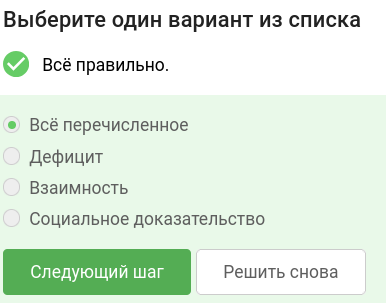
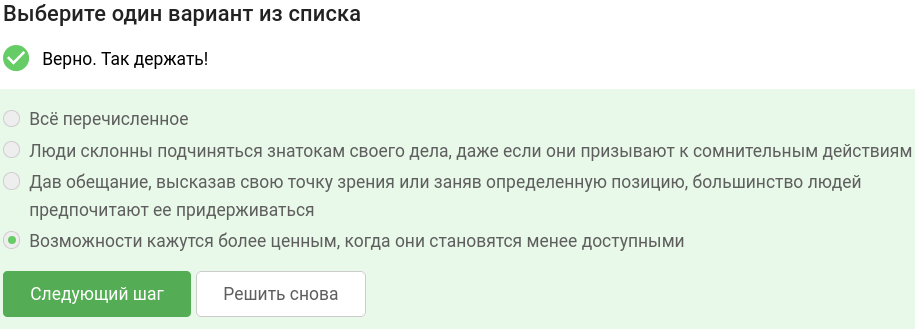

В завершении занятия вам предстоит пройти тестирование по изученному материалу, чтобы закрепить и систематизировать полученные знания.

Тест состоит из 10 вопросов с одним вариантом ответа. Если в каком-то вопросе кажется, что несколько ответов верны —  выберите наиболее точный из них.

Успешное прохождение теста позволит вам оценить свой уровень знаний в области кибербезопасности и подготовиться к следующему занятию. Желаем вам удачи!

## Что такое социальная инженерия?

## Что такое Фишинг? 

## Как расшифровывается OSINT? 

## Что такое Vishing? 

## Что такое Smishing?

## Выберите тип существующих техник маскирования?

## Что такое Evil Proxy?

## Что такое маскирование доменов?

## Какое понятие входит в «шесть принципов влияния»?

## В чем заключается принцип дефицита?

### тгк: [BoCoder_Python](https://t.me/BoCoder_Python)
