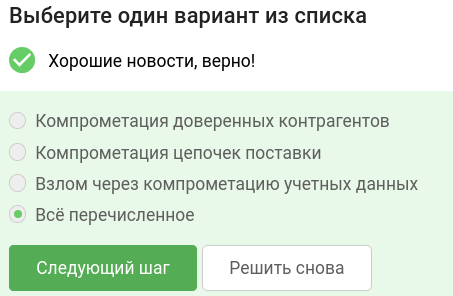
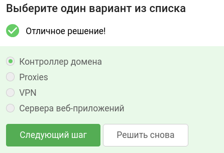
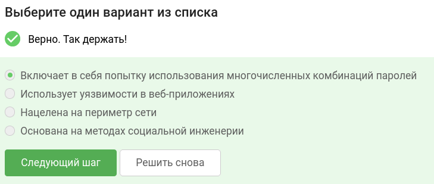
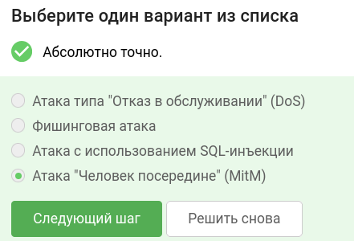
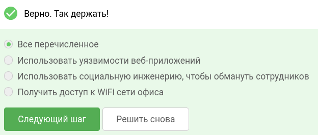
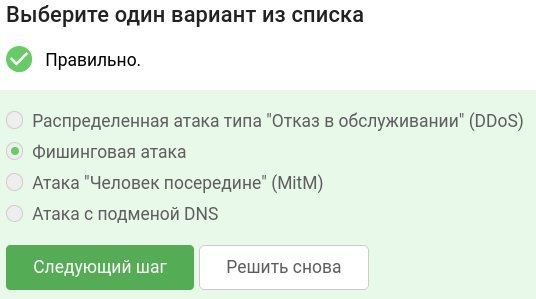
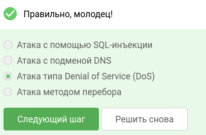
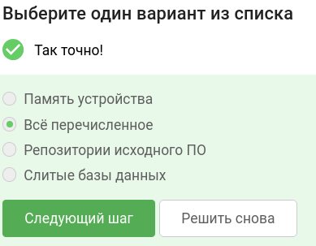

В завершении занятия вам предстоит пройти тестирование по изученному материалу, чтобы закрепить и систематизировать полученные знания.

Тест состоит из 8 вопросов с одним вариантом ответа. Если в каком-то вопросе кажется, что несколько ответов верны —  выберите наиболее точный из них.

Успешное прохождение теста позволит вам оценить свой уровень знаний в области кибербезопасности и подготовиться к следующему занятию. Желаем вам удачи!

## Что из перечисленного является атакой первичного доступа? 

## Что из перечисленного не является типичной целью для злоумышленника, пытающегося получить первоначальный доступ к сети?

## Что из перечисленного является характеристикой атаки методом перебора (brute-force)?

## Какая атака "перехватывает" данные между пользователем и точкой доступа Wi-Fi, когда доступ к сети уже получен? 

## Каким способом пентестер может попасть во внутреннюю сеть заказчика? 

## Какая из следующих атак основана на том, что злоумышленник выдает себя за законный веб-сайт или службу? 

## Какая атака включает в себя отправку искаженных или неожиданных входных данных в приложение, чтобы вызвать его отказ? 

## Где могут быть обнаружены важные данные сотрудников компании?
