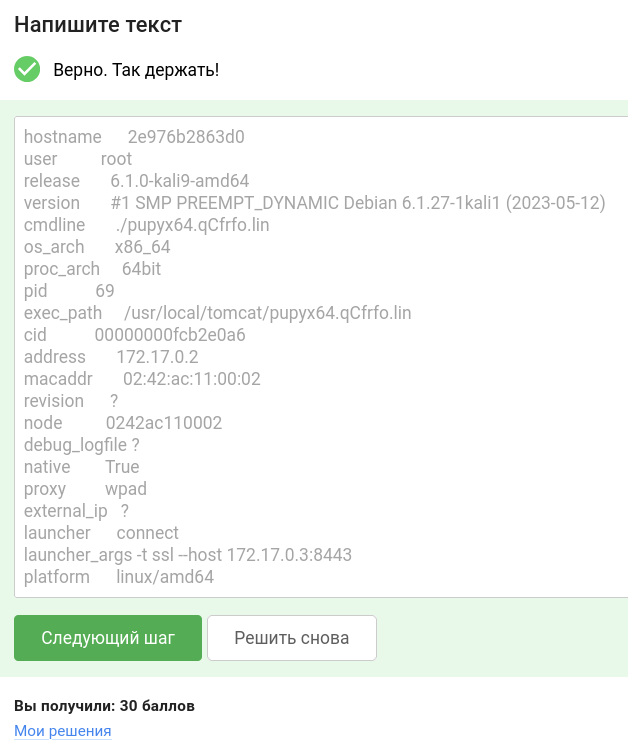

#  Уровень 3. Практика
## Практика «Закрепление доступа»

**Ответ для Stepik:** 

`hostname      2e976b2863d0
user          root
release       6.1.0-kali9-amd64
version       #1 SMP PREEMPT_DYNAMIC Debian 6.1.27-1kali1 (2023-05-12)
cmdline       ./pupyx64.qCfrfo.lin
os_arch       x86_64
proc_arch     64bit
pid           69
exec_path     /usr/local/tomcat/pupyx64.qCfrfo.lin
cid           00000000fcb2e0a6
address       172.17.0.2
macaddr       02:42:ac:11:00:02
revision      ?
node          0242ac110002
debug_logfile ?
native        True
proxy         wpad
external_ip   ?
launcher      connect
launcher_args -t ssl --host 172.17.0.3:8443
platform      linux/amd64`

### тгк: [BoCoder_Python](https://t.me/BoCoder_Python)