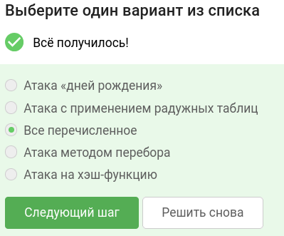
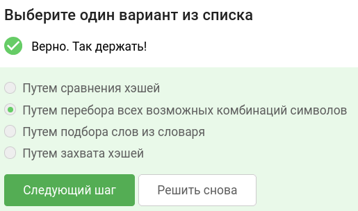
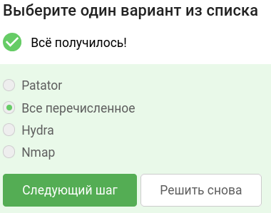
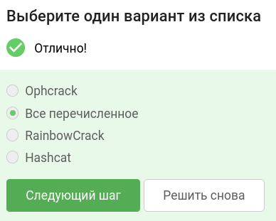
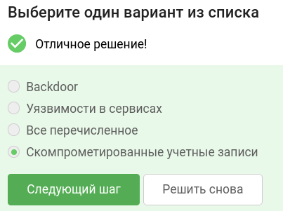
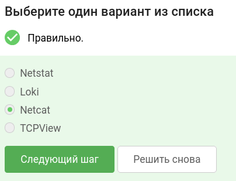
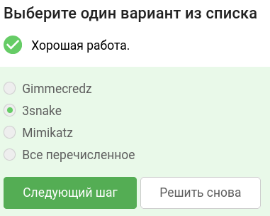
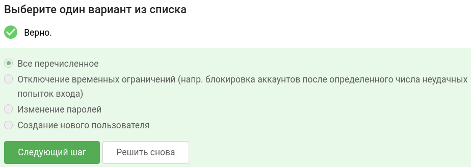
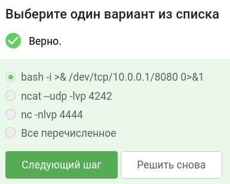
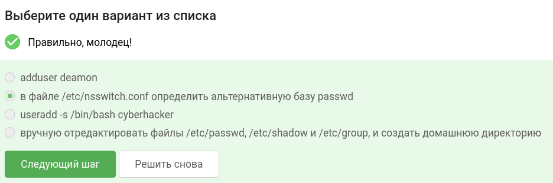

В завершении занятия вам предстоит пройти тестирование по изученному материалу, чтобы закрепить и систематизировать полученные знания.

Тест состоит из 10 вопросов с одним вариантом ответа. Если в каком-то вопросе кажется, что несколько ответов верны —  выберите наиболее точный из них.

Успешное прохождение теста позволит вам оценить свой уровень знаний в области кибербезопасности и подготовиться к следующему занятию. Желаем вам удачи!

## Что из перечисленного может относится к типу оффлайн-атак?

## Как выполняется атака brute-force?

## Какой инструмент подойдет для brute-force атаки протокола SSH?

## Какой инструмент подойдет для атак с применением радужных таблиц?

## Что лучше использовать для наиболее скрытого возврата в ранее взломанную систему?

## Что из перечисленного способно к перенаправлению портов?

## Какая из представленных утилит мониторит процессы sudo и sshd и перехватывает пароли при аутентификации?

## Какие изменения в легитимные механизмы доступа технически возможно внести при тестировании на проникновение?

## Какой из представленных вариантов reverse shell возможен?

## Как создать пользователя наиболее скрытно?

### тгк: [BoCoder_Python](https://t.me/BoCoder_Python)