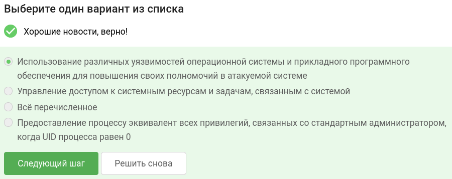
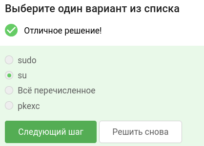
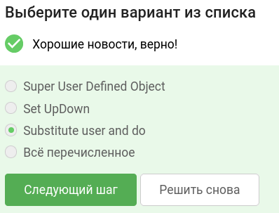
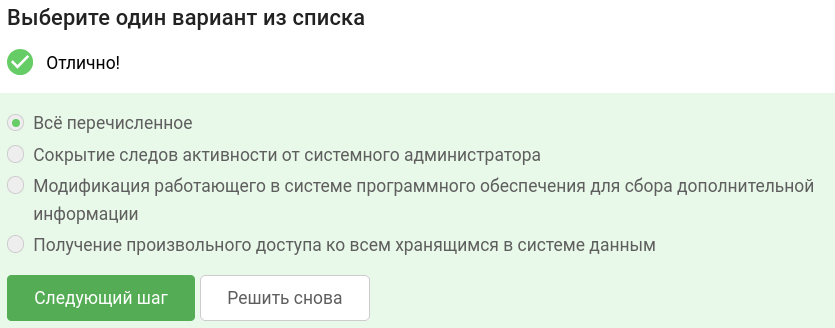
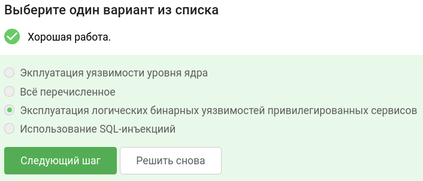
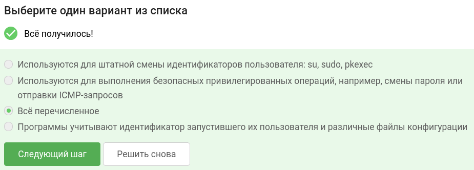
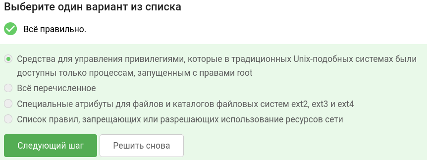
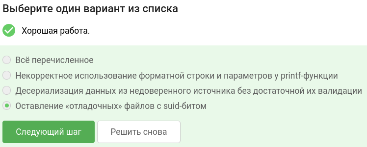
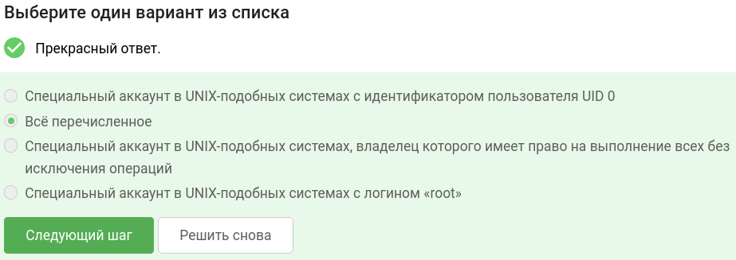
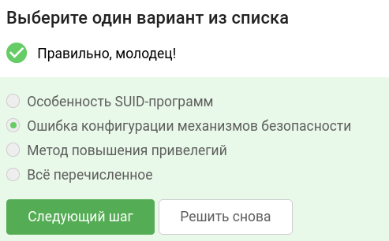

В завершении занятия вам предстоит пройти тестирование по изученному материалу, чтобы закрепить и систематизировать полученные знания.

Тест состоит из 10 вопросов с одним вариантом ответа. Если в каком-то вопросе кажется, что несколько ответов верны —  выберите наиболее точный из них.

Успешное прохождение теста позволит вам оценить свой уровень знаний в области кибербезопасности и подготовиться к следующему занятию. Желаем вам удачи!

## Что такое повышение привилегий?

## Что из перечисленного является командой Unix-подобных операционных систем, позволяющая пользователю войти в систему под другим именем, не завершая текущий сеанс?

## Как расшифровывается sudo?

## Что из перечисленного является целью повышения привилегий?

## Что является методом повышения привилегий? 

## В чем заключаются особенности SUID-программ? 

## Что такое Capabilities? 

## Что из этого является ошибкой в конфигурации механизмов безопасности?

## Кто такой суперпользователь?

## Предоставление доступа к команде sudo на файлы, дающие возможность выполнить произвольный код — это...

### тгк: [BoCoder_Python](https://t.me/BoCoder_Python)