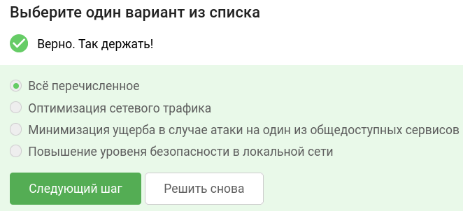
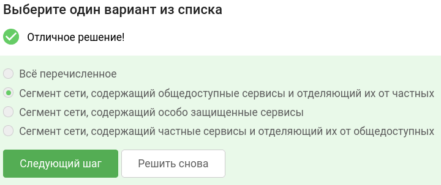
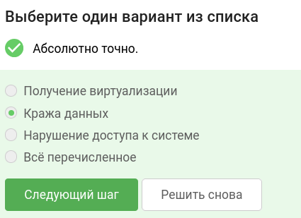
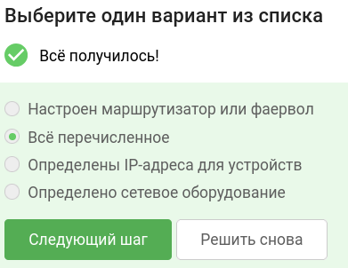
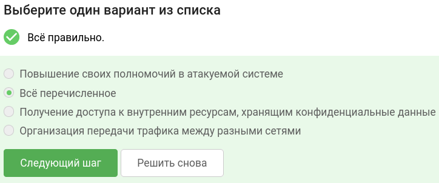
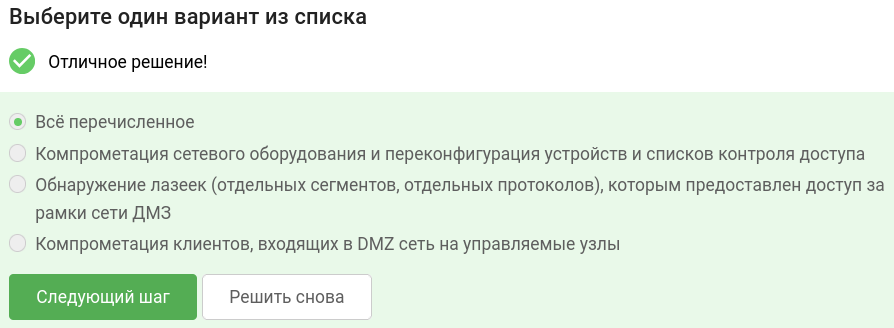
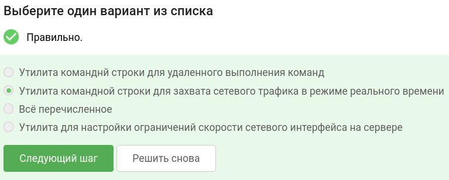
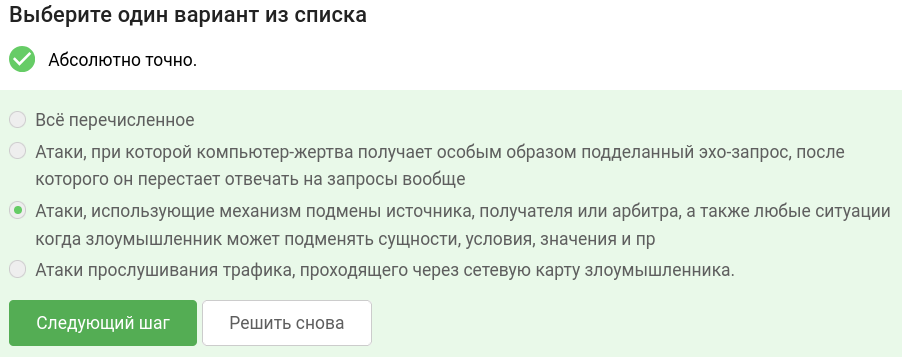
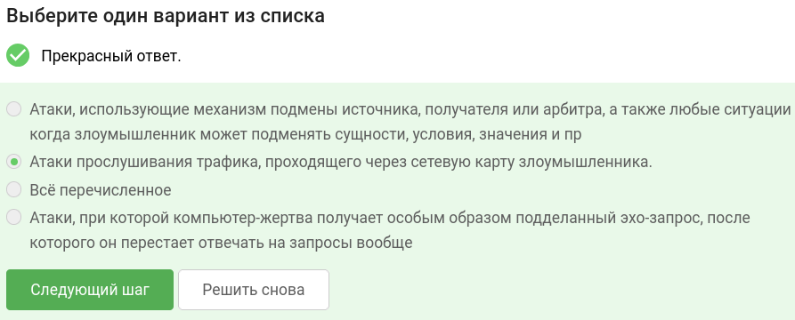
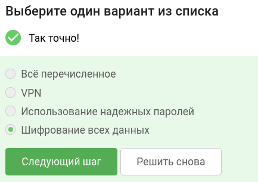

В завершении занятия вам предстоит пройти тестирование по изученному материалу, чтобы закрепить и систематизировать полученные знания.

Тест состоит из 10 вопросов с одним вариантом ответа. Если в каком-то вопросе кажется, что несколько ответов верны —  выберите наиболее точный из них.

Успешное прохождение теста позволит вам оценить свой уровень знаний в области кибербезопасности и подготовиться к следующему занятию. Желаем вам удачи!

## С какой целью сеть делят на сегменты?

## Что такое ДМЗ? 

## Какова цель MitM атаки?

## Какой критерий у настроенной ДМЗ?

## Какова цель выхода за рамки сети ДМЗ?

## Какой из ниже перечисленных вариантов способ выхода за рамки сети ДМЗ?

## Что такое tcpdump? 

## Что такое спуфинг? 

## Что такое сниффинг? 

## Выберите лучший способ защиты от MitM атак:

### тгк: [BoCoder_Python](https://t.me/BoCoder_Python)
