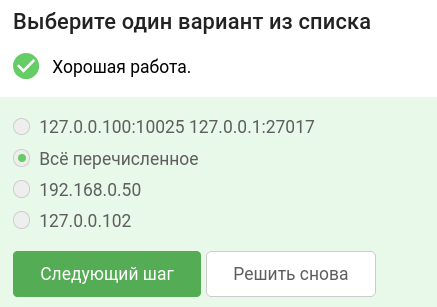
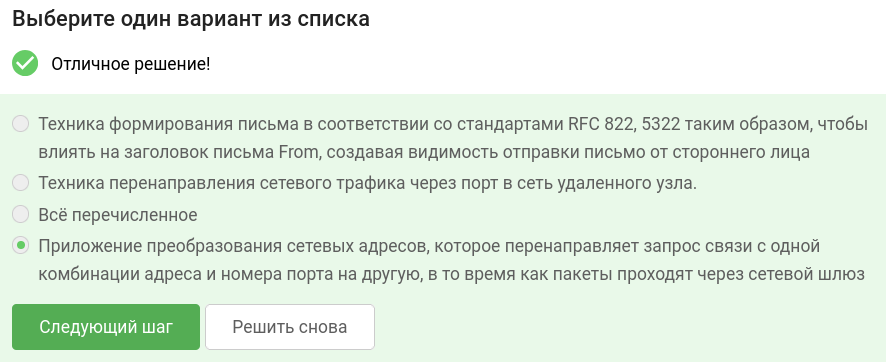
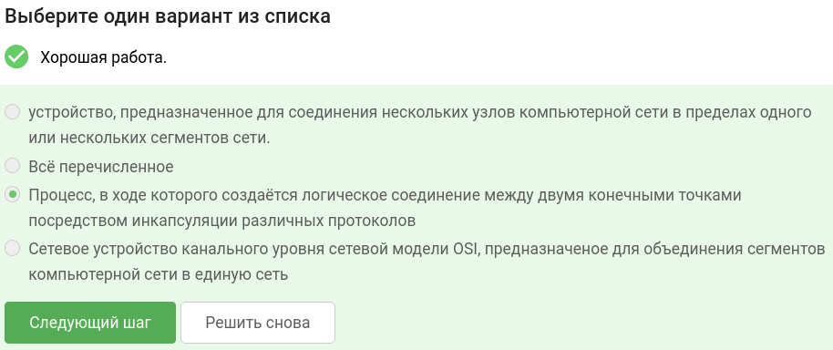
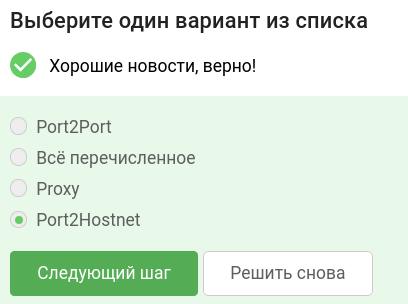
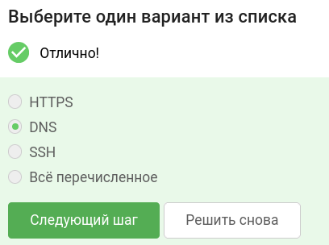
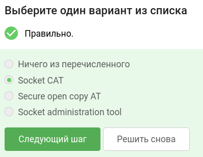
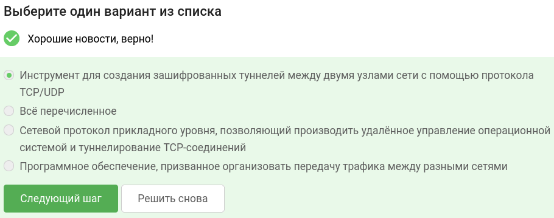
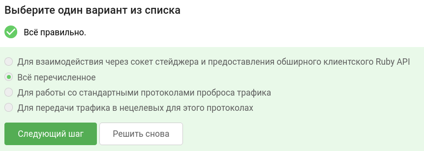
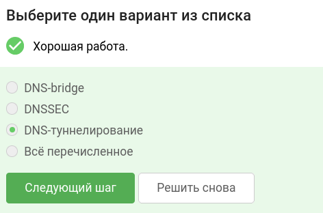
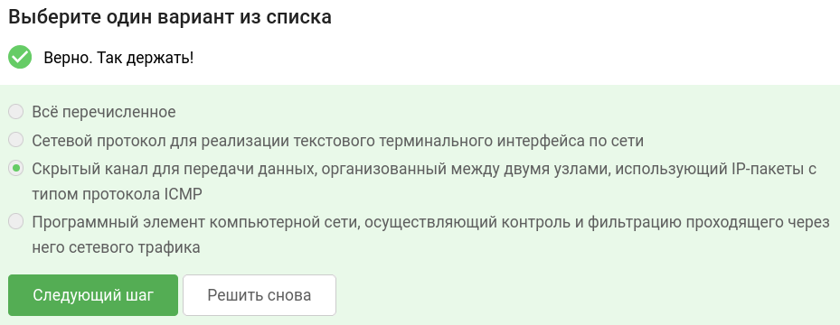

В завершении занятия вам предстоит пройти тестирование по изученному материалу, чтобы закрепить и систематизировать полученные знания.

Тест состоит из 10 вопросов с одним вариантом ответа. Если в каком-то вопросе кажется, что несколько ответов верны —  выберите наиболее точный из них.

Успешное прохождение теста позволит вам оценить свой уровень знаний в области кибербезопасности и подготовиться к следующему занятию. Желаем вам удачи!

## Какие службы и компьютеры представляют особый интерес для атакующего?

## Что такое переадресация портов? 

## Что такое туннелирование в компьютерных сетях?

## Как называется техника перенаправления сетевого трафика через порт в сеть удаленного узла?

## Нестандартный протокол, позволяющий обходить системы обнаружения, ограничения и скрывать наличие туннеля:

## Как расшифровывается Socat?

## Что такое GOST? 

## Для чего может использоваться Meterpreter?

## Как называется метод использования DNS-протокола для передачи данных между компьютерами в сети? 

## Что такое ICMP-туннель?

### тгк: [BoCoder_Python](https://t.me/BoCoder_Python)