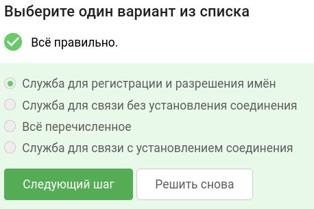
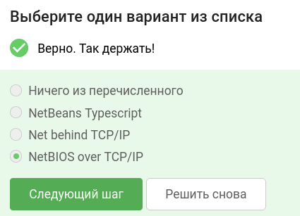
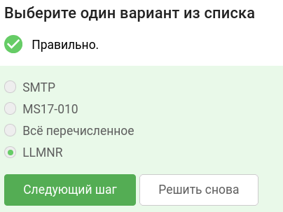
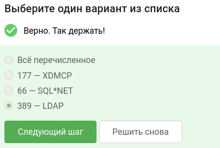
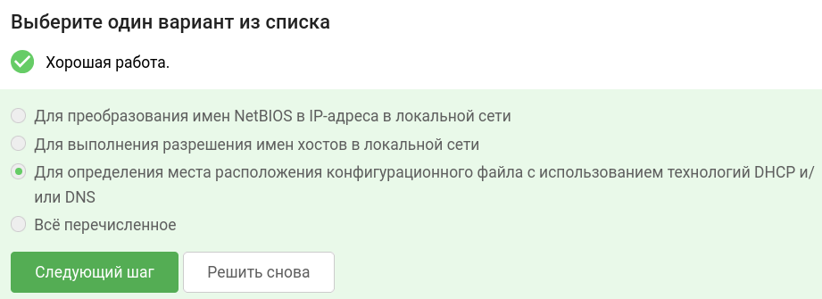
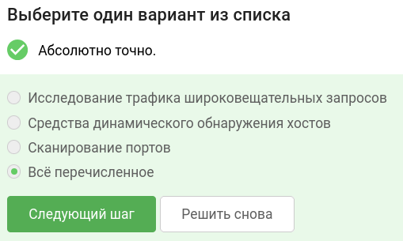
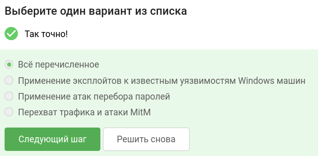
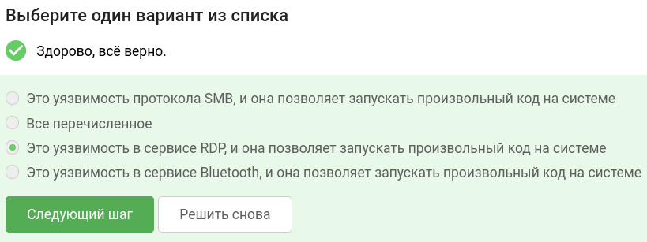
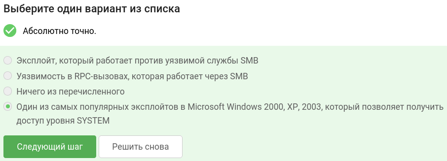
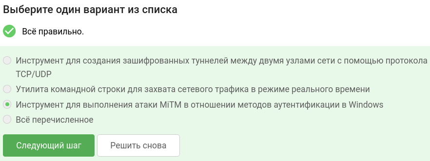

В завершении занятия вам предстоит пройти тестирование по изученному материалу, чтобы закрепить и систематизировать полученные знания.

Тест состоит из 10 вопросов с одним вариантом ответа. Если в каком-то вопросе кажется, что несколько ответов верны —  выберите наиболее точный из них.

Успешное прохождение теста позволит вам оценить свой уровень знаний в области кибербезопасности и подготовиться к следующему занятию. Желаем вам удачи!

## Что такое служба имен NetBIOS ?

## Как расшифровывается NBT? 

## Как называется протокол, который позволяет компьютерам выполнять разрешение имен хостов в локальной сети?

## Сервис на каком порту характерен для Windows-машин?

## Для чего используется метод WPAD?

## Что можно использовать для поиска Windows-машин?

## Какие могут быть способы атак на Windows-машины? 

## В чем суть уязвимости BlueKeep?

## Что такое ms08_067_netapi?

## Что такое Responder?

### тгк: [BoCoder_Python](https://t.me/BoCoder_Python)