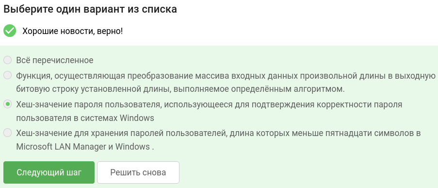
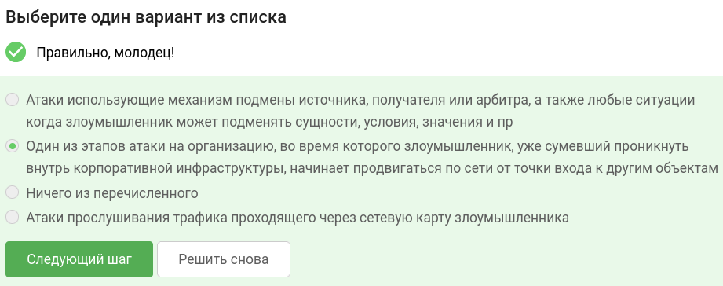
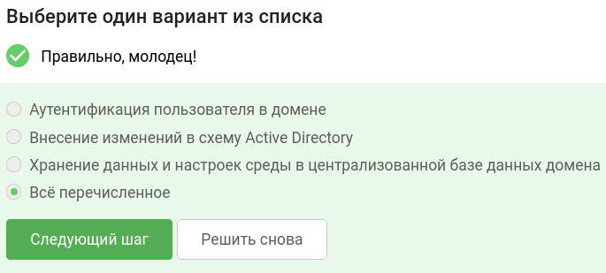
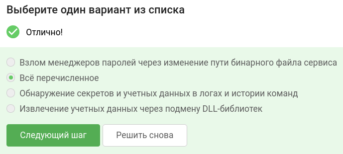
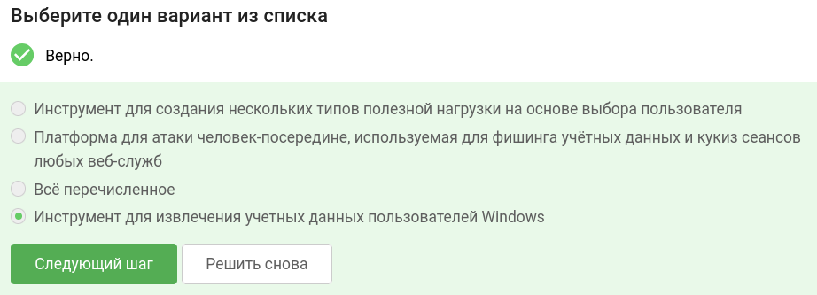
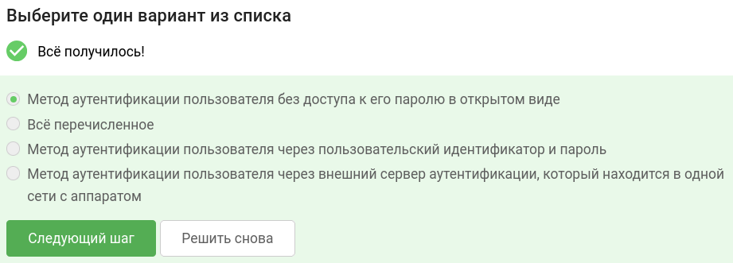
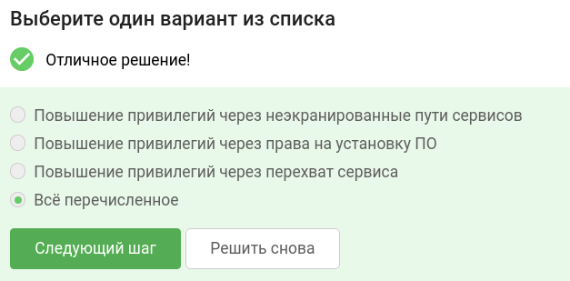
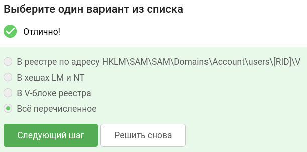
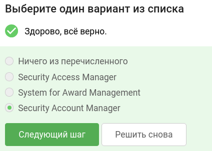
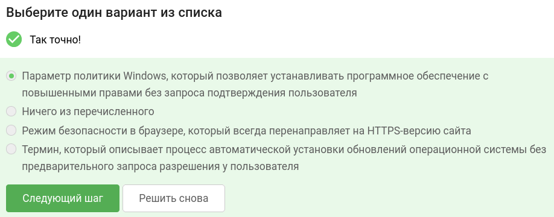

В завершении занятия вам предстоит пройти тестирование по изученному материалу, чтобы закрепить и систематизировать полученные знания.

Тест состоит из 10 вопросов с одним вариантом ответа. Если в каком-то вопросе кажется, что несколько ответов верны —  выберите наиболее точный из них.

Успешное прохождение теста позволит вам оценить свой уровень знаний в области кибербезопасности и подготовиться к следующему занятию. Желаем вам удачи!

## Что такое NT-хеш? 

## Что такое Lateral movement?

## За что может отвечать контроллер домена? 

## Какой метод повышения привилегий относится к категории извлечения секретов и учетных данных? 

## Что такое Mimikatz? 

## Что такое Pass the Hash (PtH)? 

## Какой метод повышения привилегий относится к категории эксплуатации уязвимостей конфигурации ОС Windows?

## Где могут хранится хеши паролей?

## Как расшифровывается SAM - RPC-сервер Windows ?

## Что такое AlwaysInstallElevated?

### тгк: [BoCoder_Python](https://t.me/BoCoder_Python)