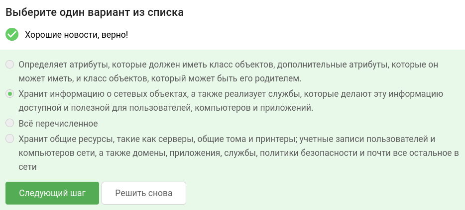
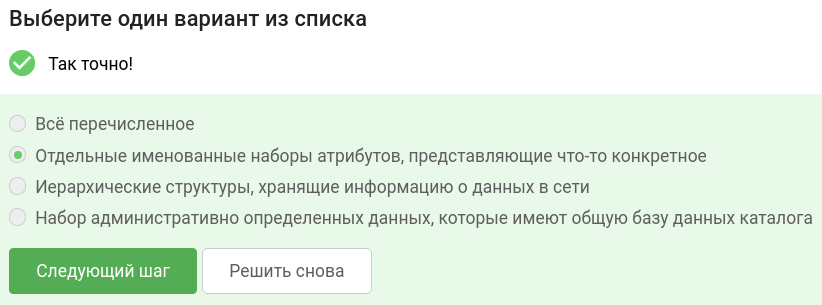
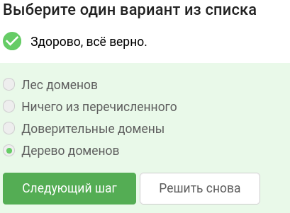
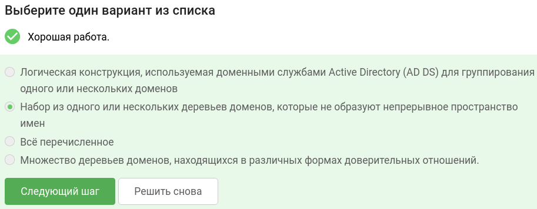
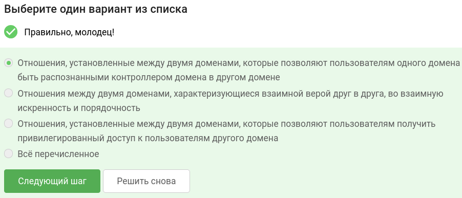
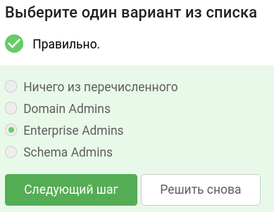
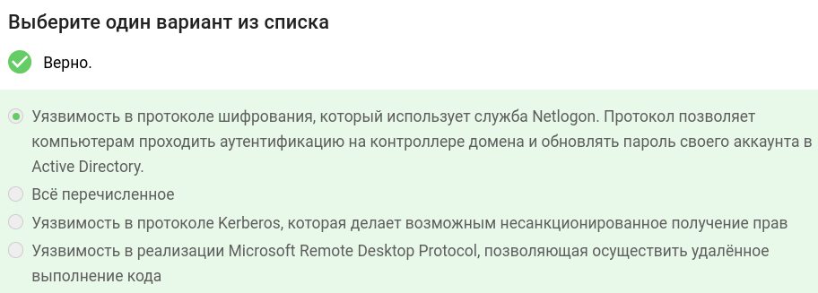
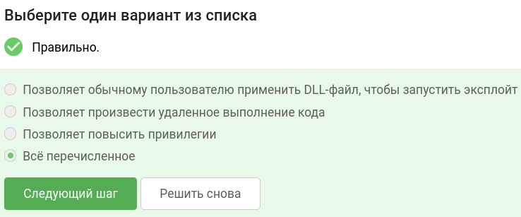
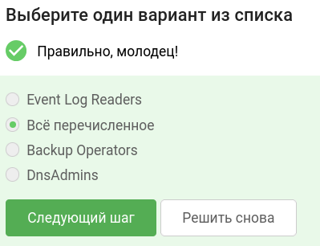
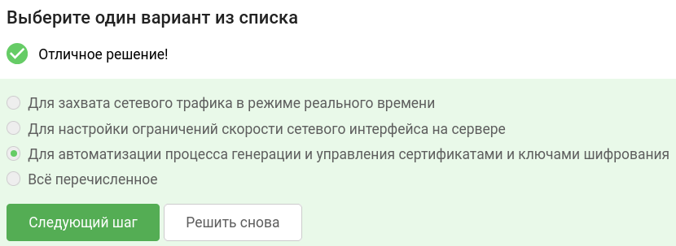

В завершении занятия вам предстоит пройти тестирование по изученному материалу, чтобы закрепить и систематизировать полученные знания.

Тест состоит из 10 вопросов с одним вариантом ответа. Если в каком-то вопросе кажется, что несколько ответов верны —  выберите наиболее точный из них.

Успешное прохождение теста позволит вам оценить свой уровень знаний в области кибербезопасности и подготовиться к следующему занятию. Желаем вам удачи!

## Что делает служба каталогов?

## Что такое объекты? 

## Как называются домены, которые имеют общую схему и конфигурацию, образующие непрерывное пространство имен?

## Что такое лес? 

## Какие отношения называют доверительными?

## Какая учётная запись по умолчанию имеет административный доступ ко всем доменам в лесу?

## Что такое Zerologon?

## В чем суть уязвимости PrintNightmare?

## Какие группы позволяют получить доступ к группам первой тройки?

## Для чего используют утилиту Certipy?

### тгк: [BoCoder_Python](https://t.me/BoCoder_Python)