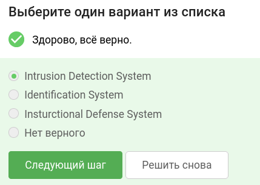
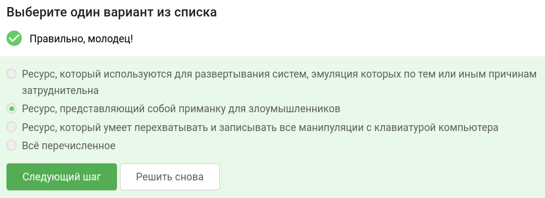
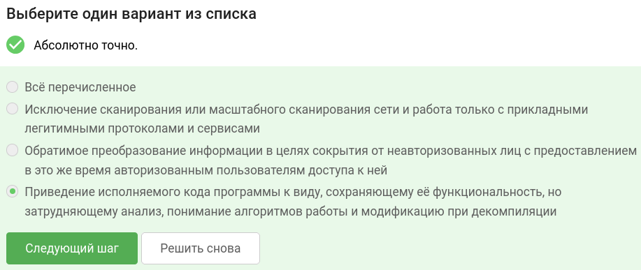
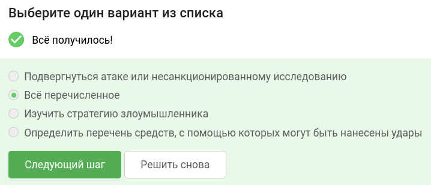
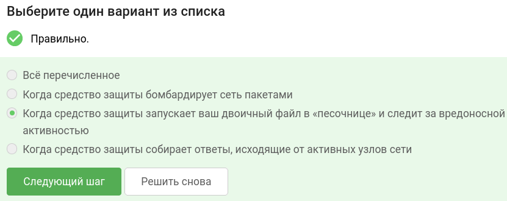
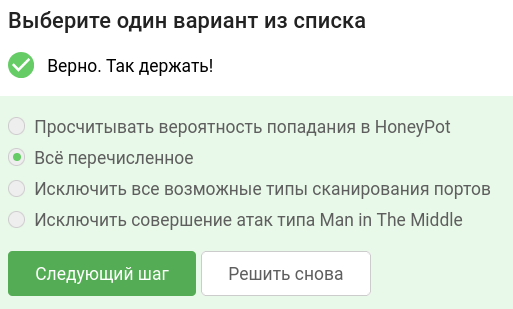
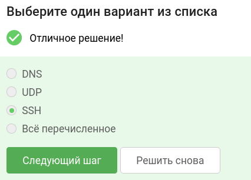
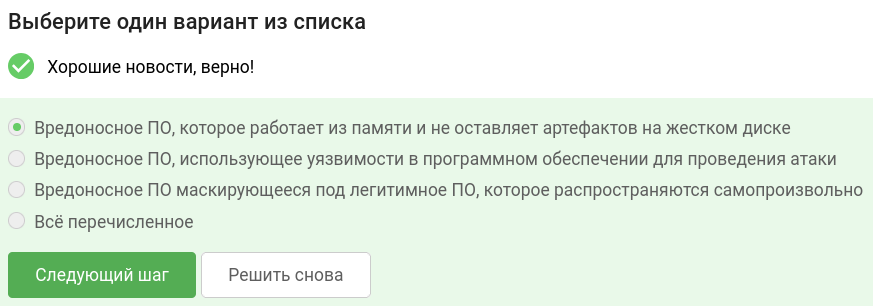
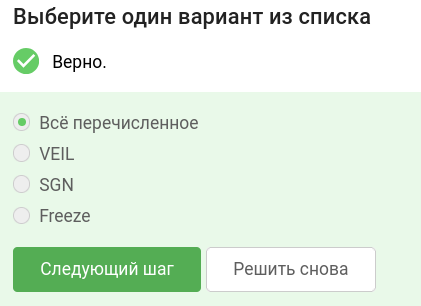
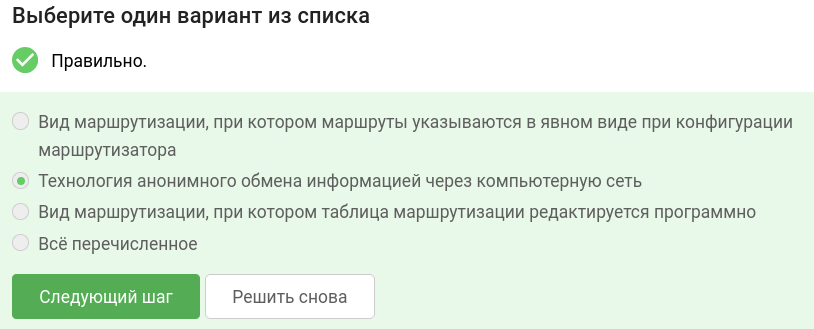

В завершении занятия вам предстоит пройти тестирование по изученному материалу, чтобы закрепить и систематизировать полученные знания.

Тест состоит из 10 вопросов с одним вариантом ответа. Если в каком-то вопросе кажется, что несколько ответов верны —  выберите наиболее точный из них.

Успешное прохождение теста позволит вам оценить свой уровень знаний в области кибербезопасности и подготовиться к следующему занятию. Желаем вам удачи!

## Как расшифровывается IDS?

## Что такое Honeypot? 

## Что такое Обфускация?

## В чем задача Honeypot?

## Что такое динамический анализ нагрузок?

## Что следует делать для снижения активности в сети? 

## Какой из представленных протоколов шифрует трафик? 

## Что такое бесфайловое вредоносное ПО? 

## Выберите инструмент генерации нагрузок для обхода Endpoint Protection Platform (EPP) и Endpoint Detection and Response

## Что такое Луковая маршрутизация?

### тгк: [BoCoder_Python](https://t.me/BoCoder_Python)